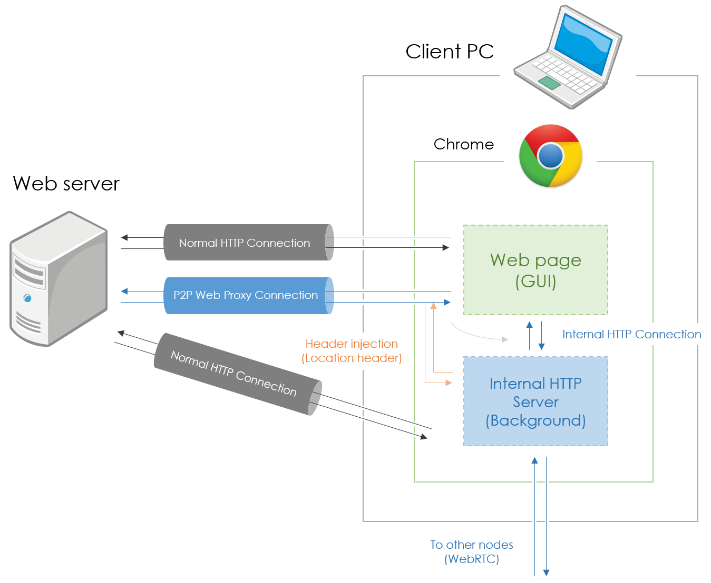

Akame & Kurome
--------------
[](https://travis-ci.org/WebRTC-CacheSharing/AkaKurome)

WebRTC Cache Sharing System 用 Chrome 拡張機能

## 開発環境

- TypeScript
- Node.js (v0.10.x)
- Visual Studio 2013
- Google Chrome

## 利用技術

- PeerJS (v0.3.14)
- gulp
- Browserify

## ビルド
プロジェクトのビルドには Node.js が必要です。

```
$ npm install
$ npm run tsd
$ npm run bower
$ npm run build
```

## 全体図



## ライセンス
MIT License<br />
Copyright (c) 2014-2015 Pine Mizune